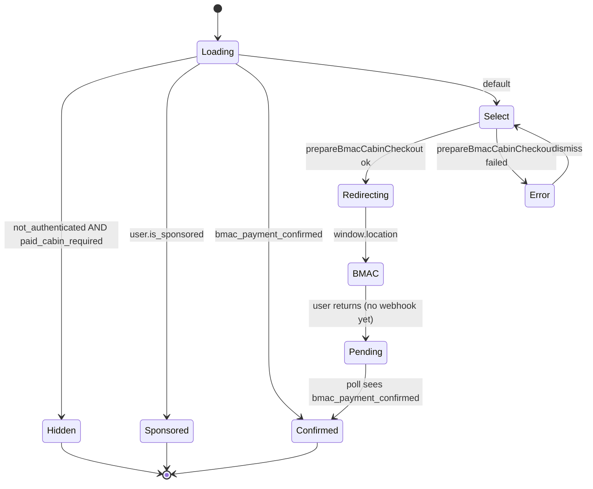
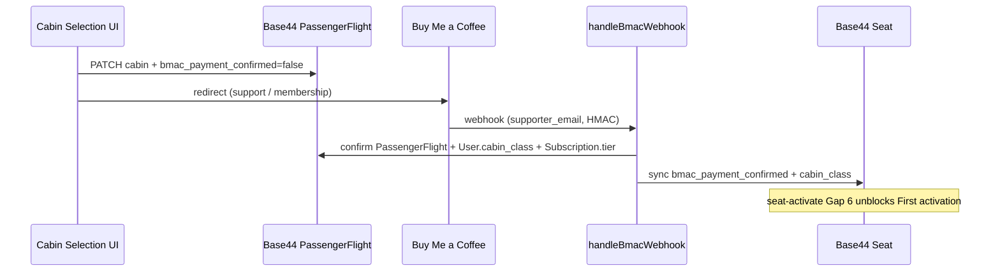

# Cabin Selection → BMAC Checkout Contract (Option A)

Cabin is chosen **before** the passenger is redirected to Buy Me a Coffee. The
`handleBmacWebhook` Base44 function confirms payment and propagates entitlement.

---

## UI sketch

### Surfaces

| Surface | When shown | Auth |
|---------|------------|------|
| `.com` `#dashboard-view` | Passenger has `seat_id` in session (`data-state=dashboard`) | Optional — Economy tip works unsigned; paid cabins need Base44 session on `.tech` redirect |
| `.tech` onboarding / settings | Post-login, before Mission Control features unlock | Required — `base44.auth.me()` |
| `Studio/index.html` | Resume-linked passenger with active flight | Required |

**Canonical implementation target:** `.tech` (authenticated Base44 client available).
`.com` dashboard shows a **read-only status pill** + deep-link to `.tech` cabin picker
until Base44 auth is wired on `.com`.

Replace the raw BMAC anchor at dashboard step **5. SUPPORT THE JOURNEY** with the
cabin panel once auth is available. Until then, keep the anchor but add a
`data-umami-event="Support Click (legacy direct)"` tag for drift tracking.

### Wireframe

```
┌─────────────────────────────────────────────────────────────┐
│  ✈ Choose Your Cabin                                        │
│  Select a cabin before checkout. Your choice is locked in    │
│  when you continue to Buy Me a Coffee.                       │
├─────────────────────────────────────────────────────────────┤
│  ┌──────────────┐ ┌──────────────┐ ┌──────────────┐        │
│  │   ECONOMY    │ │   BUSINESS   │ │    FIRST     │        │
│  │   Standard   │ │  Priority +  │ │  Full access │        │
│  │   boarding   │ │  LS Plus     │ │  LS Pro      │        │
│  │              │ │              │ │              │        │
│  │ [Continue]   │ │ [Continue]   │ │ [Continue]   │        │
│  └──────────────┘ └──────────────┘ └──────────────┘        │
│                                                             │
│  Status: ○ Payment pending   Cabin: —   Flight: FL_051126   │
│  ─────────────────────────────────────────────────────────  │
│  ⓘ Sponsored passengers: cabin is assigned automatically.   │
└─────────────────────────────────────────────────────────────┘
```

**Sponsored variant** — hide Business + First cards; show single banner:

```
┌─────────────────────────────────────────────────────────────┐
│  ✈ First Cabin — Sponsored                                  │
│  Your access is managed automatically. No payment required. │
│  [ Open Mission Control ]                                   │
└─────────────────────────────────────────────────────────────┘
```

**Confirmed variant** — `PassengerFlight.bmac_payment_confirmed === true`:

```
┌─────────────────────────────────────────────────────────────┐
│  ✈ Cabin Confirmed                                          │
│  ┌─────────────────────────────────────────────────────┐   │
│  │  FIRST  ·  Payment confirmed  ·  Apr 9, 2026        │   │
│  └─────────────────────────────────────────────────────┘   │
│  [ Open Mission Control ]                                   │
└─────────────────────────────────────────────────────────────┘
```

### UI state machine



### DOM contract

Mount inside `#dashboard-view` (`.com`) or equivalent panel on `.tech`:

```html
<section id="cabin-select-panel" class="mc-section mc-section--cabin" hidden>
  <h3 class="mc-section-title">✈ Choose Your Cabin</h3>
  <p class="mc-section-desc" id="cabin-select-desc">
    Select a cabin before checkout. Your choice is locked in when you continue to Buy Me a Coffee.
  </p>

  <div class="cabin-card-grid" role="listbox" aria-label="Cabin class">
    <button type="button" class="cabin-card" data-cabin="Economy" role="option">
      <span class="cabin-card__tier">Economy</span>
      <span class="cabin-card__blurb">Standard boarding</span>
      <span class="cabin-card__cta">Continue</span>
    </button>
    <button type="button" class="cabin-card cabin-card--plus" data-cabin="Business" role="option">
      <span class="cabin-card__tier">Business</span>
      <span class="cabin-card__blurb">Priority + LS Plus</span>
      <span class="cabin-card__cta">Continue</span>
    </button>
    <button type="button" class="cabin-card cabin-card--pro" data-cabin="First" role="option">
      <span class="cabin-card__tier">First</span>
      <span class="cabin-card__blurb">Full access + LS Pro</span>
      <span class="cabin-card__cta">Continue</span>
    </button>
  </div>

  <div class="cabin-status" aria-live="polite">
    <span id="cabin-status-payment">○ Payment pending</span>
    <span id="cabin-status-cabin">Cabin: —</span>
    <span id="cabin-status-flight">Flight: —</span>
  </div>

  <p class="cabin-error" id="cabin-select-error" hidden></p>
  <p class="cabin-footnote">Sponsored passengers: cabin is assigned automatically.</p>
</section>
```

| Element ID | Binding |
|------------|---------|
| `#cabin-select-panel` | `hidden` when `Loading → Hidden` or panel not applicable |
| `[data-cabin]` | Must match `CABIN_CLASSES` values exactly |
| `#cabin-status-payment` | `○ Payment pending` / `✔ Payment confirmed` |
| `#cabin-status-cabin` | `Cabin: {PassengerFlight.cabin}` |
| `#cabin-status-flight` | `Flight: {flight_id}` |
| `#cabin-select-error` | User-facing error from `prepareBmacCabinCheckout` |

### Interaction contract

| Step | Action |
|------|--------|
| 1 | On mount, load `base44.auth.me()` + latest `PassengerFlight` where `passenger_id = me.id` (sort `joined_at` desc) |
| 2 | Branch UI per state machine above |
| 3 | On `[data-cabin]` click → disable all cards → call `prepareBmacCabinCheckout(base44, { cabin, flightId })` |
| 4 | `ok` → set `sessionStorage['tuj:cabin_pending'] = cabin` → `window.location.href = redirectUrl` |
| 5 | On return visit, if `bmac_payment_confirmed` still false, show **Pending** + poll every 15s (max 5 min) |
| 6 | On `bmac_payment_confirmed`, render **Confirmed** variant; clear `tuj:cabin_pending` |

### Error copy

| `error` code | User message |
|--------------|--------------|
| `auth_required` | Sign in to choose a paid cabin. |
| `sponsored_bypass` | Your sponsored access is already active — no checkout needed. |
| `no_passenger_flight_row` | Join the active flight before selecting a cabin. |
| `invalid_cabin` | That cabin option is not available. |
| `base44_client_required` | Cabin selection is temporarily unavailable. Try again from Systems. |
| (network) | Could not reach checkout. Check your connection and retry. |

### Analytics (Umami)

| Event | When |
|-------|------|
| `Cabin Select View` | Panel rendered (include `state`) |
| `Cabin Select Click` | Card clicked (`cabin` property) |
| `Cabin Select Redirect` | Precondition write succeeded |
| `Cabin Select Error` | Precondition write failed (`error` property) |
| `Cabin Select Confirmed` | Poll or mount sees `bmac_payment_confirmed` |

### CSS notes

Reuse existing dashboard tokens:

- Section wrapper: `mc-section` (same as Boarding Sequence / Your Paths)
- Cards: new `cabin-card` grid; match `mc-nav-btn` cyan border + hover glow
- Pro/Plus accents: `cabin-card--pro` gold tint, `cabin-card--plus` teal tint
- Status row: `mc-seat-badge` typography for the confirmed pill

### `.com` interim behaviour

Until Base44 auth ships on `.com`:

1. Keep `#cabin-select-panel` hidden.
2. Change step 5 label to **5. SUPPORT THE JOURNEY →** linking to
   `https://www.thispagedoesnotexist12345.tech/cabin` (or settings route).
3. Pass `?flight_code=` + `?tuj_code=` query params through.

---

## Backend flow



## Shared constants

Import from `gate-contract.js` (`.com` + `.tech`):

| Export | Purpose |
|--------|---------|
| `CABIN_CLASSES` | `Economy` \| `Business` \| `First` |
| `BMAC_CHECKOUT.SUPPORT_URL` | Redirect target after precondition write |
| `BMAC_CHECKOUT.PAID_CABINS` | `Business`, `First` — require BMAC before entitlement |
| `prepareBmacCabinCheckout(base44, { cabin, flightId? })` | Precondition write helper |
| `cabinToSeatClass(cabin)` | Maps to Seat boarding enum |

## UI responsibilities

1. Passenger must be authenticated (`base44.auth.me()`).
2. Passenger must have an active `PassengerFlight` row with `bmac_payment_confirmed = false`.
3. On cabin button click:
   - Call `prepareBmacCabinCheckout(base44, { cabin, flightId })`.
   - On `ok: true`, assign `window.location.href = result.redirectUrl`.
   - On `error: 'sponsored_bypass'`, hide paid cabin CTAs (access via `syncBmacMembers`).
4. Economy support is optional — still stamp `cabin: 'Economy'` if the passenger explicitly chooses Economy before a tip.

### Example (.tech / Mission Control)

```javascript
import { CABIN_CLASSES, prepareBmacCabinCheckout } from '/gate-contract.js';

async function onCabinSelect(cabin) {
  const result = await prepareBmacCabinCheckout(base44, {
    cabin,
    flightId: activeFlightCode,
  });

  if (!result.ok) {
    showError(result.error);
    return;
  }

  window.location.href = result.redirectUrl;
}
```

## Webhook propagation

`handleBmacWebhook` (Base44) writes:

| Target | Fields |
|--------|--------|
| `User` | `cabin_class` |
| `PassengerFlight` | `bmac_payment_confirmed`, `bmac_payment_confirmed_at`, `cabin` |
| `Subscription` | `tier` (`free` / `plus` / `pro`), `status: active` |
| `Seat` | `bmac_payment_confirmed`, `bmac_payment_confirmed_at`, `cabin_class` |

### Cabin → tier / seat mapping

| PassengerFlight.cabin | Subscription.tier | Seat.cabin_class |
|-----------------------|-------------------|------------------|
| Economy | `free` | `Economy` |
| Business | `plus` | `Economy` |
| First | `pro` | `First` |

Business uses the Economy boarding email path on Seat; plus entitlement is on Subscription.

### Seat lookup order

1. `Seat.user_email` = supporter email
2. `Seat.tuj_code` = `User.passport_seat_id`
3. `Seat.passenger_id` or `Seat.assigned_passenger_id` = user id

If no Seat row exists, payment still confirms on PassengerFlight/User/Subscription;
`seatSynced: false` in the webhook response.

## Sponsored bypass

Users with `User.is_sponsored = true` (Veterans, Retirees, Unhoused) must **not**
use this flow. Their cabin is set by `syncBmacMembers` / `checkBmacStatus`.
`prepareBmacCabinCheckout` returns `error: 'sponsored_bypass'`.

## Failure modes

| Symptom | Cause | Resolution |
|---------|-------|------------|
| `needs_review` webhook action | `PassengerFlight.cabin` was null at payment time | Admin sets cabin + re-runs or manual flag clear |
| `no_passenger_flight_row` in UI | User not joined to flight | Complete flight join first |
| `no_flight_row` in webhook | Payment without precondition write | Admin review |
| First activation blocked | `Seat.bmac_payment_confirmed === false` | Confirm webhook ran; check Seat sync |
| `seatSynced: false` | No Seat row for user | Create/bind seat; or activate after manual sync |

## Deploy checklist

1. Base44 entity fields exist (see `docs/base44-functions/README.md` → handleBmacWebhook).
2. `BMAC_WEBHOOK_SECRET` set in Base44 vault.
3. BMAC webhook URL points at deployed `handleBmacWebhook`.
4. Cabin Selection UI calls `prepareBmacCabinCheckout` before every paid redirect.

## Related

- `base44-functions/handleBmacWebhook.ts` — webhook handler reference
- `gate-contract.js` — shared constants + precondition helper
- `netlify/functions/seat-activate.js` — Gap 6 BMAC flag check on Seat
